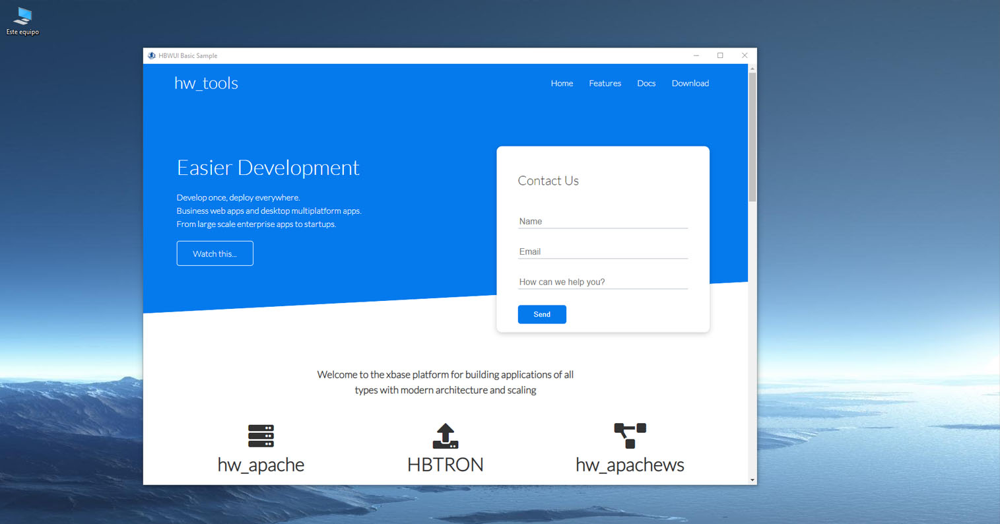
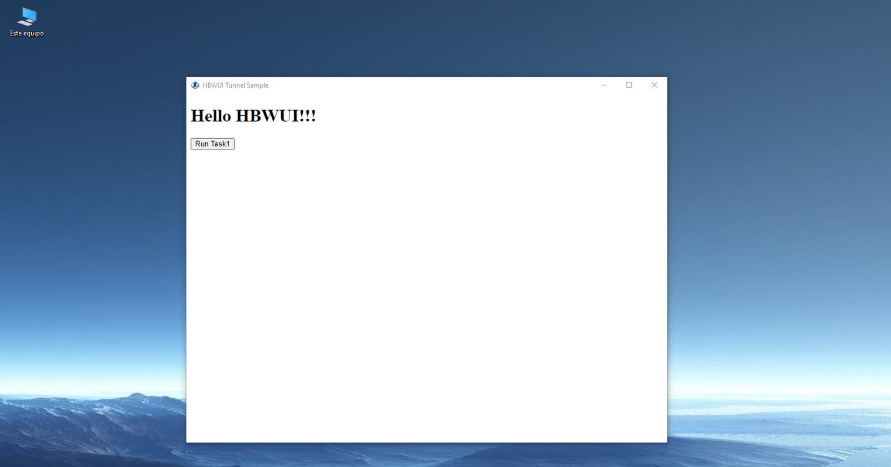
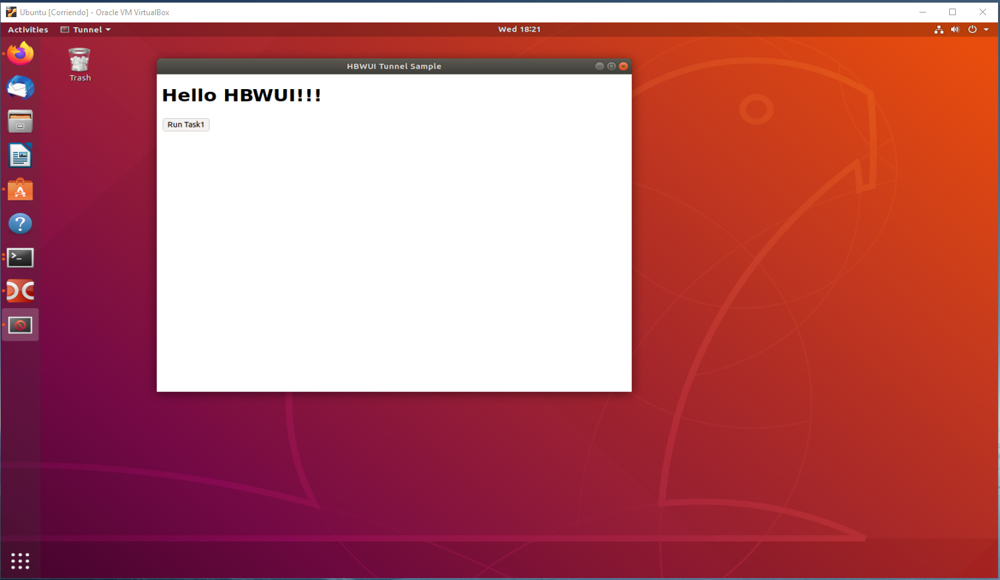

# hbWUI WebView2/Cocoa/GTK Harbour Web UI
#
# Multiplatform Harbour GUI programs made in html/ccs and just a bit of js
#

### Simple hbWUI initialization( examples/basic.prg )

    hbWUI_Init( cUrl, cTitle, nWidth, nHeight, lFullscreen, lResizable, lMaximized, lDebug )

### Advanced hbWUI initialization( examples/  advanced.prg - login.prg - login2.prg )

    hbWUI_SetTitle( cTitle )                    // Set hbWUI windows title - Must be defined before hbWUI_create().
    hbWUI_Create()                              // Create hbWUI.
    hbWUI_SetSize( nWidth, nHeight )            // Set hbWUI windows size.
    hbWUI_SetFullscreen( lFullscreen )          // Start hbWUI in fullscreen mode(F12).
    hbWUI_SetResizable( lResizable )            // Enable resize hbWUI windows.
    hbWUI_SetDebug( lDebug )                    // Enable context menu.
    hbWUI_SetMaximized( lMaximized )            // Start hbWUI maximized.
    hbWUI_Navigate( cHtml )                     // Inyect html or define an Url for the hbWUI.
    hbWUI_ApplyCss( cCss )                      // Apply css style to hbWUI. Must be pure css code. This func should only be called from a tunnel function.
    hbWUI_RunJs( cJscode )                      // Run js code
    hbWUI_GetElementById( cId, cKey )           // Get attributes from DOM Elemment specify by Id. If not exist cKey return "undefined". NOTE: Only attributes. 
    hbWUI_SetElementById( cId, cKey, xValue )   // Set ANY parameter to DOM Element specify by Id. Ex: value, class, style...etc. NOTE: Case sensitive!
    hbWUI_Run()                                 // Start hbWUI.
    hbWUI_Exit()                                // Stop hbWUI execution.

### Harbour <-> Javascript( See example examples/tunnel.prg )

Call it from Javascript:

    add( 1,2 ); 

Run it from Harbour

    hbWUI_tunnel( "add", "{| a,b | add( a, b )}" )  //define tunnel before hbWUI_Create()

    function add( a, b )    // define function in your project

        hbWUI_RunJs( 'alert("The result is: ' + str( a + b ) + '")' )

    return     

### ErrorBlock -> Error log file hbWUI_error.log
    
## Windows( 1 or 2 ) 

1) Make sure you have the LAST Microsoft Edge (Chromium beta, dev, or canary) installed.
2) Get the runtime directly(https://developer.microsoft.com/en-us/microsoft-edge/webview2/#download-section). Any of them.

<p align="center"></p>
<p align="center"></p>

**In Windows, Webview2 creates a USERDATAFOLDER. By default hbWUI save it in %APPDATA%\project.exe\
All yours .html/.css/.jpg, etc will be cached in this folder, like a browser. Please keep this in mind( content="no-cache" ).**

https://docs.microsoft.com/en-us/microsoft-edge/webview2/concepts/user-data-folder

## Linux

hbWUI depends on `gtk+-3.0` and `webkit2gtk-4.0`:

```sh
sudo apt-get install libgtk-3-dev libwebkit2gtk-4.0-37 libwebkit2gtk-4.0-dev
```
<p align="center"></p>
<p align="center"></p>

## MacOS

hbWUI depends on the Cocoa and Webkit frameworks.

# http://www.hbtron.com

