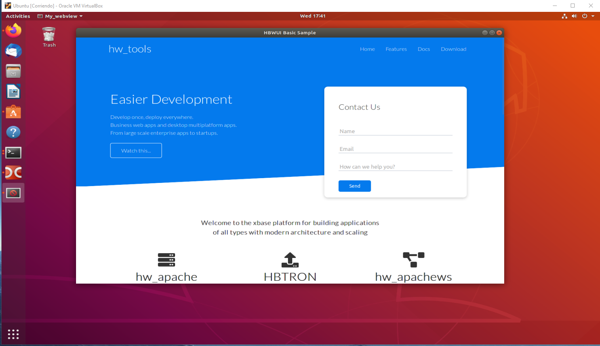

# hbWUI WebView2/Cocoa/GTK Harbour Web UI
#
# Multiplatform Harbour GUI programs made in html/ccs and just a bit of js
#

### Simple hbWUI initialization( examples/basic.prg )

    hbwui_Init( cUrl, cTitle, nWidth, nHeight, lFullscreen, lResizable, lMaximized, lDebug )

### Advanced hbWUI initialization( examples/advanced.prg )

    hbwui_SetTitle( cTitle )           // Set hbWUI windows title - Must be defined before hbwui_create().
    hbwui_Create()                     // Create hbWUI.
    hbwui_SetSize( nWidth, nHeight )   // Set hbWUI windows size.
    hbwui_SetFullscreen( lFullscreen ) // Start hbWUI in fullscreen mode(F12).
    hbwui_SetResizable( lResizable )   // Enable resize hbWUI windows.
    hbwui_SetDebug( lDebug )           // Enable context menu.
    hbwui_SetMaximized( lMaximized )   // Start hbWUI maximized.
    hbwui_Navigate( cHtml )            // Inyect html or define an Url for the hbWUI.
    hbwui_ApplyCss( cCss )             // Apply css style to hbWUI. Must be pure css code. This func should only be called from a tunnel function.
    hbwui_RunJs( cJscode )             // Run js code
    hbwui_Run()                        // Start hbWUI.
    hbwui_Exit()                       // Stop hbWUI execution.

### Harbour <-> Javascript( See example examples/tunnel.prg )

Call it from Javascript:

    add( 1,2 ); 

Run it from Harbour

    hbwui_tunnel( "add", "{| a,b | add( a, b )}" )  //define tunnel before hbwui_Create()

    function add( a, b )    // define function in your project

        hbwui_RunJs( 'alert("The result is: ' + str( a + b ) + '")' )

    return     
    
## Windows( 1 or 2 ) 

1) Make sure you have the LAST Microsoft Edge (Chromium beta, dev, or canary) installed.
2) Get the runtime directly(https://developer.microsoft.com/en-us/microsoft-edge/webview2/#download-section). Any of them.

<p align="center"></p>
<p align="center"></p>

## Linux

hbWUI depends on `gtk+-3.0` and `webkit2gtk-4.0`:

```sh
sudo apt-get install libgtk-3-dev libwebkit2gtk-4.0-37 libwebkit2gtk-4.0-dev
```
<p align="center"></p>
<p align="center"></p>

## MacOS

hbWUI depends on the Cocoa and Webkit frameworks.

# http://www.hbtron.com

